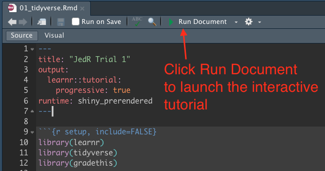

# JedR 

To be clear, this isn’t a package. It’s some training material.

## Overview

This project is series of [learnr](https://rstudio.github.io/learnr/)
interactive tutorials designed to develop and improve R skills with a
heavy lean toward the [tidyverse](https://www.tidyverse.org/). There are
two main goals:

- To focus tutorials on feats of skill or tasks to accomplish instead of
  on specific packages.
- To use the same data whenever possible to avoid the cognitive load of
  learning new data for each example.

While we strive to use the
[starwars](https://dplyr.tidyverse.org/reference/starwars.html) data as
much as possible, we’ve had to introduce other Star Wars related data in
some situations.

We also try to have a little fun.

This project is in its infancy. You know, like Baby Yoda.

## How to use this project

There are two types of lessons here:

- **JedR Training**: Tutorials focused on feats of skills instead of on
  specific packages. For instance, “How to manage dates” vs “How to use
  lubridate.”
- **JedR Trials**: A test of skill for JedR Padawans to check their
  understanding for specific feats of skill. These trials are used in
  our J 327D Reporting with Data class.

JedR Padawans can download this repo and run each notebook on their
local machines. The notebooks are stored in the `tutorials/` and
`trials/` folders. All notebooks require `tidyverse`, `learnr` and
`gradethis`. Some notebooks might require additional packages.

Once you open a notebook, use the **Run Document** option.

Another option is to use the links listed below to run the lessons
online (at least until we run out of money to pay for shinyapps.io).

### JedR Training

- [Recoding values](https://utdata.shinyapps.io/jedr-categorization/):
  When you need to rename values in your data, perhaps to create a new
  categorization schema.
- [Managing dates](https://utdata.shinyapps.io/jedr-manage-dates/): When
  you need help parsing dates or making useful date parts for grouping.

### JedR Trials

- [Introduction](https://utdata.shinyapps.io/jedr-trial-01-intro/):
  Introduces the `starwars` data and the interactive format of the
  lessons. Covers some basic functions to look at data.
- [Summarize with
  Count](https://utdata.shinyapps.io/jedr-trial-02-count/): Covers
  counting rows using group_by and summarize. (We skip `count()` here to
  focus on group_by, summarize and arrange.)
- [Summarize with Math](https://utdata.shinyapps.io/jedr-trial-03-sum/):
  Covers grouping data and math functions within summarize.
- [Plotting](https://utdata.shinyapps.io/jedr-trial-04-plot/): Making a
  very basic ggplot chart.
- Pivoting: TK
- Bind and Join: TK

### Others to come?

This is a work in progress. We have a [list of
ideas](https://github.com/utdata/jedr-training/issues/2) and would be
consider additions that follow our philosophy (which is admittedly also
under development).

## Data sources

All data is in the `data/` folder except `starwars` which is utilized
from `tidyverse`.

- [starwars](https://dplyr.tidyverse.org/reference/starwars.html)
  characters data that is part of the tidyverse. It’s our main data set.
  Small enough to wrap your head around; complex and dirty enough to
  provide good examples.
- [starwarsrebels](data/starwarsrebels.csv) is a list of episodes of
  Star Wars Rebels from
  [tvmaze.com](https://www.tvmaze.com/shows/117/star-wars-rebels/episodes)

### Other possible data sources

These might be explored later.

- [SWAPI](https://swapi.dev/)
- [Star Wars Databank](https://www.starwars.com/databank)
- We’ve pulled some data from
  [Kaggle](https://www.kaggle.com/jsphyg/star-wars), which notes “This
  data was gathered using the Star Wars API that is no longer available.
  The origin of the data is [The Star Wars
  Wiki](https://starwars.fandom.com/wiki).”
  - `characters`
  - `planets`
  - `species`
  - `starships`
  - `vehicles`

## Credits

This project was the brainchild of [Christian
McDonald](https://journalism.utexas.edu/faculty/christian-mcdonald),
assistant professor of practice at the School of Journalism and Media at
the University of Texas at Austin. He began collaborating soon
thereafter with [Dr. Jo
Lukito](https://journalism.utexas.edu/faculty/jo-lukito), an assistant
professor also at UT JaM.

Other contributors include:

- [Christian
  Overgaard](https://journalism.utexas.edu/graduate/profiles/doctoral/christian-staal-bruun-overgaard),
  Doctoral student. He’s helped think through the project and built
  tutorials.
- Tamara Rodriguez designed our JedR hex logo.
